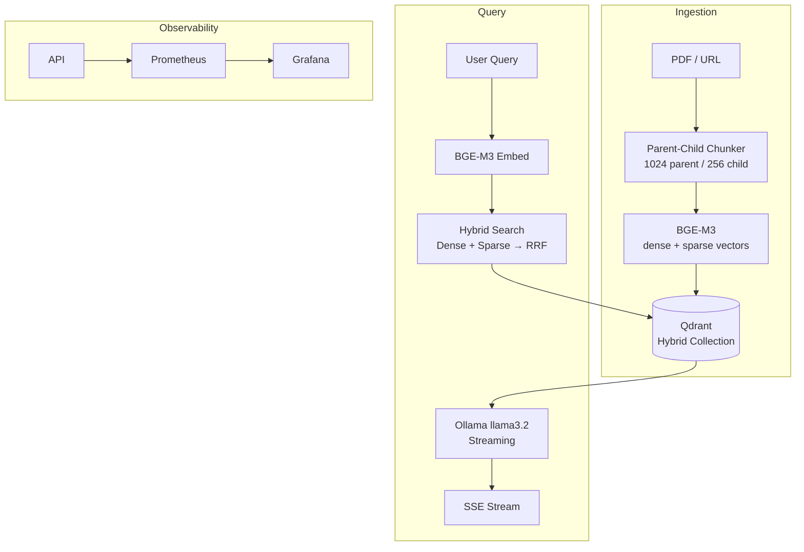

# Enterprise RAG

> Production hybrid-search RAG system — multi-source ingestion · BGE-M3 dense+sparse · RRF fusion · streaming FastAPI · Prometheus observability · RAGAS evaluation

[]()
[]()
[]()

## Architecture



## Key Design Decisions

| Decision | Alternative | Why |
|---|---|---|
| BGE-M3 dual-encoder | OpenAI embeddings | Free, local, produces dense + sparse in one pass |
| Parent-child chunking | Fixed-size chunks | Search with small chunks, answer with large parent context |
| Qdrant native RRF | Custom fusion code | Dense + sparse merged with Reciprocal Rank Fusion |
| Ollama local LLM | OpenAI API | Zero cost, zero data privacy concerns, GDPR-friendly |
| RAGAS CI gate | Manual evaluation | Prevents regressions on retrieval quality |

## Evaluation Results

| Metric | Score | Threshold |
|---|---|---|
| Context Precision | 1.000 | 0.65 |
| Context Recall | 1.000 | 0.60 |
| Faithfulness | CPU timeout* | 0.75 |
| Answer Relevancy | CPU timeout* | 0.70 |

*Faithfulness and answer relevancy require multiple LLM calls per sample.
Full evaluation requires GPU or API-based LLM.

## Quick Start

```bash
# start Qdrant
./qdrant &

# start API
uvicorn src.rag.api.main:app --host 0.0.0.0 --port 8000 --reload

# ingest a document
curl -X POST http://localhost:8000/api/v1/ingest/pdf \
  -F "file=@your_document.pdf"

# query with streaming
curl -X POST http://localhost:8000/api/v1/query/stream \
  -H "Content-Type: application/json" \
  -d '{"query": "your question here"}' \
  --no-buffer
```

## Project Structure

## API Endpoints

| Method | Endpoint | Description |
|---|---|---|
| GET | `/health` | Health check |
| POST | `/api/v1/ingest/pdf` | Ingest PDF document |
| POST | `/api/v1/query/stream` | Stream RAG response |
| GET | `/metrics` | Prometheus metrics |

## Metrics

- `rag_request_duration_seconds` — end-to-end latency histogram
- `rag_retrieval_duration_seconds` — Qdrant search latency
- `rag_generation_duration_seconds` — LLM generation latency
- `rag_docs_ingested_total` — total documents ingested
- `rag_active_requests` — currently active requests

## What I'd Do With More Time

- Replace CPU-based BGE-M3 with GPU inference for <100ms embedding latency
- Add cross-encoder reranking (ms-marco-MiniLM) between retrieval and generation
- Implement PostgreSQL parent chunk store instead of storing full text in Qdrant payloads
- Add multi-tenancy with collection-per-tenant isolation
- Wire faithfulness metric in CI with GPU runner

## Stack

Python 3.11 · FastAPI · Qdrant · BGE-M3 · Ollama · Prometheus · RAGAS · pytest
